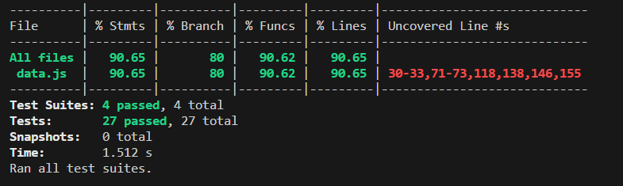

# Markdown Links Analyzer
 
 
 
 
 
 
 
 
 


## Índice

* [1. Preámbulo](#1-preámbulo)
* [2. Resumen del proyecto](#2-resumen-del-proyecto)
* [3. Instrucciones de instalación](#3-instrucciones-de-instalación💻)
* [4. Instrucciones de uso](#4-instrucciones-de-uso📁)
  * [4.1 Uso de CLI con archivos](#41-uso-de-cli-para-encontrar-enlaces-en-un-archivo)
  * [4.2 Uso de CLI con --validate](#42-uso-de-cli-con-argumento---validate)
  * [4.3 Uso de CLI con --stats](#43-uso-de-cli-con-argumento---stats)
  * [4.4 Uso de CLI con --validate y --stats](#44-uso-de-cli-con-argumento---validate-y---stats)
  * [4.5 Uso de CLI con directorios](#45-uso-de-cli-para-la-lectura-de-directorios)
  * [4.6 Respuesta de --validate y --stats a directorios](#46-respuesta-de---validate-y---stats-en-la-lectura-de-un-directorio)
* [5. Testeo de funciones](#5-testeo-de-funciones🔎)
* [6. Planificación](#6-planificación📆)
* [7. Herramientas utilizadas](#7-tecnologías-utilizadas🙆‍♀️💻)
***

## 1. Preámbulo.

Markdown es un lenguaje de marcado que facilita la aplicación de formato a un texto empleando una serie de caracteres de una forma especial. En principio, fue pensado para elaborar textos cuyo destino iba a ser la web con más rapidez y sencillez que si estuviésemos empleando directamente HTML. Y si bien ese suele ser el mejor uso que podemos darle, también podemos emplearlo para cualquier tipo de texto, independientemente de cual vaya a ser su destino. Markdown es ampliamente popular entre los desarrolladores y a menudo se utiliza para crear documentación, archivos README, publicaciones en foros, blogs y más.

Uno de los problemas que se enfrentan en la comunidad de código abierto es que estos archivos MD suelen incluir enlaces que con el tiempo se rompen o se vuelven inválidos. Esto reduce significativamente el valor de la información compartida.

Por este motivo es que se creó una herramienta utilizando Node.js que pueda leer y analizar enlaces en archivos Markdown. 

## 2. Resumen del proyecto.

Esta herramienta consiste en una libreria de Node.js, que permite extraer todos los enlaces dentro de un archivo de tipo Markdown, identificar cuales son los códigos de respuesta de las consultas, realizar estadísticas como: cuántos enlaces estan rotos, cuáles son únicos y cuántos hay en total.

## 3. Instrucciones de instalación:computer:.

## 4. Instrucciones de uso:file_folder:.

### 4.1 Uso de CLI para encontrar enlaces en un archivo.

Al escribir en la terminal el siguiente comando y ejecutarlo:

```mdlinks ./ruta```

Se imprimirá un arreglo de objetos con las url, la referencia dada al enlace y la ruta del archivo donde se encontró el enlace. 
Ejemplo:

```mdlinks ./docs/textoprueba.md```
```
[{
    text: 'Markdown-it',
    url: 'https://www.npmjs.com/package/markdown-it',
    file: 'C:\\Users\\LNAnd\\Documents\\Ejercicio-MDLinks\\DEV009-md-links\\docs\\textoprueba.md'
  },
  {
    text: 'marked',
    url: 'https://github.com/markedjs/marked',
    file: 'C:\\Users\\LNAnd\\Documents\\Ejercicio-MDLinks\\DEV009-md-links\\docs\\textoprueba.md'
  },
  {
    text: 'Cheerio',
    url: 'https://cheerio.js./',
    file: 'C:\\Users\\LNAnd\\Documents\\Ejercicio-MDLinks\\DEV009-md-links\\docs\\textoprueba.md'
  }]
  ```
  ### 4.2 Uso de CLI con argumento --validate

  Al ejecutar el siguiente comando:

  ```mdlinks ./docs/textoprueba.md --validate```

  Se va a verificar y obtener el codigo de respuesta de los links, obteniendo la siguiente respuesta en un arreglo de objetos:

  ```
  [  
  {
    text: 'Markdown-it',
    url: 'https://www.npmjs.com/package/markdown-it',
    file: 'C:\\Users\\LNAnd\\Documents\\Ejercicio-MDLinks\\DEV009-md-links\\docs\\textoprueba.md',
    status: 200,
    info: 'ok'
  },
  {
    text: 'marked',
    url: 'https://github.com/markedjs/marked',
    file: 'C:\\Users\\LNAnd\\Documents\\Ejercicio-MDLinks\\DEV009-md-links\\docs\\textoprueba.md',
    status: 200,
    info: 'ok'
  },
  {
    text: 'Cheerio',
    url: 'https://cheerio.js./',
    file: 'C:\\Users\\LNAnd\\Documents\\Ejercicio-MDLinks\\DEV009-md-links\\docs\\textoprueba.md',
    status: 404,
    info: 'fail'
  }
]
```
### 4.3 Uso de CLI con argumento --stats
Si se ejecuta el comando.

```mdlinks ./docs/textoprueba.md --stats```

Se imprimirán en consola cuántos enlaces hay en total y cuántos son únicos. Por ejemplo:

```
{ Total: 6, Unique: 6 }
```
### 4.4 Uso de CLI con argumento --validate y --stats
Al ejecutar el siguiente comando usando los argumentos validate y stats.

```mdlinks ./docs/textoprueba.md --stats --validate```

Se verifica el status de los links obtenemos en la terminal cuántos enlaces hay en total, cuántos son únicos y cuántos estan rotos.

```
{ Total: 6, Unique: 6, Broken: 1 }
```
### 4.5 Uso de CLI para la lectura de directorios.

Al ejecutar el comando:

```mdlinks ./docs/testFiles```

Se puede acceder y obtener los enlaces encontrados en todos los archivos con extensión .md dentro del directorio solicitado. Por ejemplo la respuesta al comando anterior sería:

```
[
  {
    text: 'issues',
    url: 'https://docs.github.com/es/issues',
    file: 'C:\\Users\\LNAnd\\Documents\\Ejercicio-MDLinks\\DEV009-md-links\\docs\\testFiles\\textoconLinks.md'
  },
  {
    text: 'Cheerio',
    url: 'https://cheerio.js./',
    file: 'C:\\Users\\LNAnd\\Documents\\Ejercicio-MDLinks\\DEV009-md-links\\docs\\testFiles\\textoconLinks.md'
  },
  {
    text: 'JSDOM',
    url: 'https://www.npmjs.com/package/jsdom',
    file: 'C:\\Users\\LNAnd\\Documents\\Ejercicio-MDLinks\\DEV009-md-links\\docs\\testFiles\\textoprueba2.md'
  },
  {
    text: 'Cheerio',
    url: 'https://cheerio.js./',
    file: 'C:\\Users\\LNAnd\\Documents\\Ejercicio-MDLinks\\DEV009-md-links\\docs\\testFiles\\textoprueba2.md'
  }
  ]
```
### 4.6 Respuesta de --validate y --stats en la lectura de un directorio.

La respuesta de los dos argumentos es exactamente igual que al analizar un archivo directamente. Usando la opción --validate, obtenemos un arreglo con objetos por cada link encontrado en todos los archivos del directorio. En el caso de usar --stats o --validate y --stats si se llegara a encontrar enlaces repetidos en diferentes archivos, dentro de la estadística de enlaces únicos se contarán una sóla vez. Tomando en cuenta el ejemplo del punto 4.4 la respuesta sería la siguiente:

```mdlinks ./docs/testFiles --stats```

```
{ Total: 4, Unique: 3 }
```


```mdlinks ./docs/testFiles --validate --stats```

```
{ Total: 4, Unique: 3, Broken: 2 }
```

## 5. Testeo de funciones:mag_right:.
En la carpeta test del repositorio se encuentran los test de acuerdo a los hitos en los que se fue avanzando en el proyecto, en total se hicieron 27 tests a las funciones puras utilizadas en la promesa mdlinks, estas funciones se encuentran en el archivo data.js.



## 6. Planificación:calendar:.


## 7. Tecnologías utilizadas:ok_woman::computer:.

- Javascript
- Node.js
- Axios
- Jest
- NPM
- Lucidchart
- Github projects con issues y milestones


